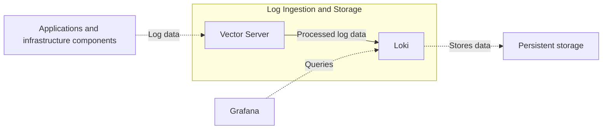

# Log Ingestion and Storage

## Purpose

The Log Ingestion and Storage deployment unit provides a secure platform capability that receives, processes and stores log data, preserves its integrity, makes it reliably available for retrieval, and enforces defined legal, regulatory and operational retention and deletion requirements.

## Components

The deployment unit consists of:

* Vector Server, responsible for receiving and processing log data.
* Loki, responsible for storing log data and making it available for retrieval.

## Boundary

The deployment unit is responsible for receiving, processing and storing log data sent by applications and infrastructure components.

It includes:

* Securely receiving log data.
* Reliably storing received log data in the provided storage.
* Transforming received log data into the centrally defined format.
* Making stored log data available for querying by other applications.

It excludes:

* Sending log data from producing applications or infrastructure components.
* Providing and managing the underlying storage infrastructure and its encryption.
* Visualising or presenting log data to end users.

## Interfaces and Dependencies

### Interfaces

* Log ingestion through the Vector source interface, receiving events from upstream Vector instances. The interface is defined in the [Vector source documentation](https://vector.dev/docs/reference/configuration/sources/vector/) and the corresponding [Vector sink documentation](https://vector.dev/docs/reference/configuration/sinks/vector/). The configured protocols, ports and security settings are documented in [Deployment](deployment.md).
* Log query and retrieval through the Loki HTTP API. The interface is defined in the [Loki HTTP API documentation](https://grafana.com/docs/loki/latest/reference/loki-http-api/). The exposed endpoints, ports and security settings are documented in [Deployment](deployment.md).

### Dependencies

The deployment unit depends on:

* A Kubernetes runtime.
* Persistent storage, including encryption provided by the storage capability.
* Central network and security capabilities that permit the defined ingestion and query network flows.
* Centrally defined log formats.
* Centrally defined retention and deletion requirements.
* Centrally defined access requirements.

## Stakeholders and Governance

### Stakeholders

* Application and infrastructure teams that provide log data.
* Grafana, as the preferred application for querying and presenting stored log data.
* IT Operations, responsible for operating and supporting the deployment unit.
* Security and Compliance, responsible for defining applicable security, access, retention and regulatory requirements.

### Governance

* Log formats are defined centrally and applied by the deployment unit.
* Retention and deletion requirements are defined by the responsible governance roles and enforced by the deployment unit.
* Grafana is the preferred access path for querying stored log data.
* Direct access by other applications requires explicit justification and authorisation.
* New log producers must comply with the defined interface, security and data requirements.

## Architecture

The deployment unit consists of a central ingestion and processing component and a log storage component.

Vector Server receives log data from applications and infrastructure components, transforms it into the centrally defined format and forwards it to Loki.

Loki stores the processed log data and exposes the query interface. Grafana is the preferred consumer of this interface.

## Related Documentation

* [Deployment](deployment.md)
* [Architecture Deviations](architecture-deviations.md), when applicable
