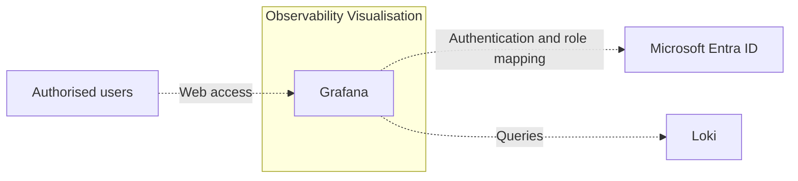

# Observability Visualisation

## Purpose

The Observability Visualisation deployment unit provides Grafana as the central capability for exploring and presenting observability data through dashboards and interactive views.

## Components

The deployment unit consists of:

* Grafana, responsible for querying configured observability data sources and presenting the resulting information through dashboards and interactive views.

## Boundary

The deployment unit provides Grafana and its connection to approved observability data sources.

It includes:

* Deploying and configuring Grafana.
* Configuring Loki as the initial observability data source.
* Providing secured access to the Grafana interface.
* Managing the Grafana configuration required for the platform integration.

It excludes:

* Creating and managing dashboards.
* Collecting, processing or storing observability data.
* Managing the underlying observability data sources.
* Managing central identity, network or storage capabilities.

## Interfaces and Dependencies

### Interfaces

* User access through the Grafana web interface.
* User authentication through Microsoft Entra ID.
* Connection from Grafana to Loki through the Loki HTTP API.
* The configured protocols, ports and security settings are documented in [Deployment](deployment.md).

### Dependencies

The deployment unit depends on:

* A Kubernetes runtime.
* The Log Ingestion and Storage deployment unit as its initial observability data source.
* Microsoft Entra ID for user authentication and role assignment.
* Centrally managed Entra ID groups and application roles for assigning Grafana access and administrator privileges.
* Central network and security capabilities that permit user access to Grafana and connectivity from Grafana to Loki.
* Secure management of credentials and secrets required by Grafana.

## Stakeholders and Governance

### Stakeholders

* IT Operations, which uses Grafana to analyse and support platform and application services.
* Application and infrastructure teams, which use Grafana to consult observability data.
* Security and Compliance, which defines applicable access, audit and security requirements.
* IT Operations, which manage the Entra ID groups and application roles used for Grafana access.

### Governance

* Microsoft Entra ID is the authoritative source for user authentication and role assignment.
* Grafana access and administrator privileges are assigned through centrally managed Entra ID groups and application roles.
* Direct local user and administrator accounts in Grafana should be avoided, except for documented emergency or technical accounts.
* Loki is the initial approved observability data source.
* Additional data sources require explicit approval and must comply with the defined security and access requirements.
* Dashboard creation and management are outside the scope of this deployment unit.

## Architecture

Grafana connects to Loki as its initial observability data source and presents the returned data to authorised users.

User authentication and role assignment are provided through Microsoft Entra ID.

## Related Documentation

* [Deployment](deployment.md)
* [Architecture Deviations](architecture-deviations.md), when applicable
