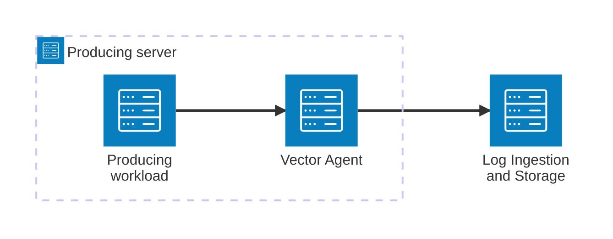

# Vector Agent

## Purpose

The Vector Agent deployment unit provides a reusable capability for collecting log data from a producing workload and securely forwarding it to the Log Ingestion and Storage deployment unit.

## Components

The deployment unit consists of:

Vector Agent, responsible for collecting log data from the producing workload and forwarding it to the Log Ingestion and Storage deployment unit.

## Boundary

The deployment unit is responsible for collecting log data from a producing workload and forwarding it to the Log Ingestion and Storage deployment unit.

It includes:

* Deploying and configuring the Vector Agent.
* Collecting log data from configured workload-specific sources.
* Applying centrally defined metadata and forwarding requirements.
* Securely forwarding collected log data to the Log Ingestion and Storage deployment unit.

It excludes:

* Producing the log data.
* Centrally storing or querying log data.
* Managing the producing workload itself.
* Managing the central Log Ingestion and Storage capability.

## Interfaces and Dependencies

### Interfaces

* Log collection from workload-specific sources configured for the Vector Agent.
* Log forwarding to the Log Ingestion and Storage deployment unit through its defined Vector ingestion interface.
* The configured protocols, ports and security settings are documented in [Deployment](deployment.md).

### Dependencies

The deployment unit depends on:

* A producing workload that exposes log data through supported sources.
* A supported host operating system capable of running the Vector Agent.
* The Log Ingestion and Storage deployment unit as its forwarding destination.
* Network and security capabilities that permit the required outbound log flow.
* Centrally defined log formats and metadata requirements.
* Centrally defined security requirements for log forwarding.

## Stakeholders and Governance

### Stakeholders

* IT Operations, responsible for deploying, operating and supporting the Vector Agent.
* Application and infrastructure teams, which provide the workload-specific log sources to be collected.
* Security and Compliance, which defines applicable security and logging requirements.

### Governance

* The Vector Agent deployment and baseline configuration are managed centrally.
* Workload-specific log sources are configured per deployment instance.
* Centrally defined log formats, metadata and security requirements must be applied consistently.
* The Vector Agent must forward log data only to approved Log Ingestion and Storage endpoints.
* Changes to the central Vector Agent configuration must remain reusable across supported workloads and operating systems.

## Architecture

The Vector Agent is deployed alongside a producing workload and collects log data from configured workload-specific sources.

It applies the centrally defined baseline configuration and forwards the collected log data to the Log Ingestion and Storage deployment unit through its defined ingestion interface.



```

## Related Documentation

* [Deployment](deployment.md)
* [Architecture Deviations](architecture-deviations.md), when applicable
